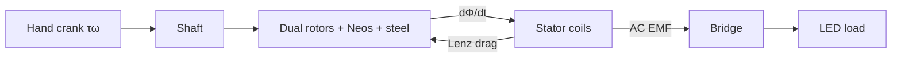

# SCHEMATIC — AFPM-Desk-v2 Polarity, Wiring, Stack

Low-voltage educational Faraday generator. No mains.

---

## 1. Mechanical stack (side view, shaft horizontal)

```
  CRANK ══╤════ SHAFT ═══════════════════════════════╤══
          │                                           │
         BRG                                         BRG
          │                                           │
         H1                                           H2
          │                                           │
     STEEL-A                                         STEEL-B
     ROTOR-A  ▓▓▓ N/S magnets facing ──►    ◄── magnets S/N ▓▓▓  ROTOR-B
          │         ↕ air ~2 mm                 ~2 mm ↕        │
          │              ║ STATOR + 6 COILS ║                  │
          │              ║   (coreless)     ║                  │
          └──────────────╨──── pillars ────╨──────────────────┘
                              BASE FRAME
                                 │
                          ELECTRONICS TRAY
```

Flux (aligned pole): `steel-A → mag-A → air → coil → air → mag-B → steel-B` with circumferential return in each back-iron between adjacent poles.

---

## 2. Facing polarity rule

At angular station \(i\):

| Rotor | Facing stator |
|-------|----------------|
| A, even \(i\) | **N** |
| A, odd \(i\) | **S** |
| B, even \(i\) | **S** (opposite of A) |
| B, odd \(i\) | **N** |

```
        Rotor A face (toward stator)          Rotor B face (toward stator)
                 M0 N                                    M0 S
              M7 S   M1 S                             M7 N   M1 N
                 \   /                                   \   /
           M6 N ---●--- M2 N                       M6 S ---●--- M2 S
                 /   \                                   /   \
              M5 S   M3 S                             M5 N   M3 N
                 M4 N                                    M4 S
```

Adjacent on same rotor: always alternate. Across gap: always attract (N↔S).

---

## 3. Coil layout

6 coils C0…C5 at angles \(30° + i\cdot 60°\) (offset from magnet zero).

```
              C0
               |
        C5     |     C1
           \   |   /
      C4 ---- ● ---- C2
           /   |   \
        C3     |
```

Wind all coils the **same sense**. Mark start (•) and finish.

---

## 4. Recommended first wiring — one phase → bridge → LED

Phase A = C0 + C3 in series (180° apart, same polarity sense when aiding):

```
  C0• ── C0f ── C3• ── C3f ──●── AC1
  C0 start tied after verifying aiding ……………●── AC2   (adjust)

  AC1 ──┐         ┌── (+) ── 220–470Ω ── LED ── (−)
        │ BRIDGE  │
  AC2 ──┤ RECT    ├── (−) ────────────────────────┘
        └─────────┘
```

Bridge diamond:

```
        AC1
         │
    ┌────┴────┐
   D1▷       ◁D2
    │         │
   (+)       (−)
    │         │
   D3▷       ◁D4
    └────┬────┘
         │
        AC2
```

---

## 5. Full 3-phase (educational upgrade)

| Phase | Coils series |
|-------|--------------|
| A | C0 + C3 |
| B | C1 + C4 |
| C | C2 + C5 |

Star (Y): join one end of A,B,C; other ends → 3-phase bridge (or 6 diodes).  
Verify each series pair is **aiding** before starring.

---

## 6. Mermaid — energy flow



---

## 7. Polarity check

1. Spin slowly; DMM ACV on one coil.  
2. Add second coil in series — V should **rise**. If it falls, reverse one lead.  
3. Repeat for each phase pair.

---
*End SCHEMATIC — AFPM-Desk-v2*
